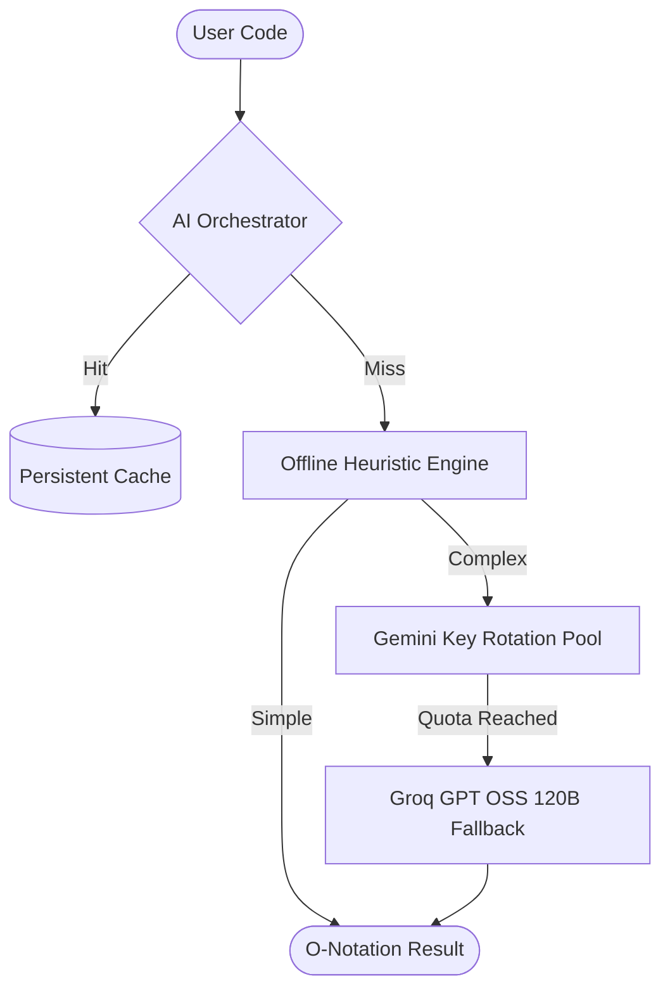

# 📖 TimeComplexityAI: The Premium AI Code Complexity Architect

[](https://timecomplexityai.vercel.app/)
[](https://react.dev/)
[](https://groq.com/)
[](https://ai.google.dev/)

**TimeComplexityAI** is an elite developer platform that transforms the abstract world of Big O notation into high-fidelity, interactive narratives. Engineered with a **Multi-Provider AI Fallback Architecture**, it ensures 100% service uptime by cycling through an elastic pool of Gemini and Groq (GPT OSS 120B) engines to provide mathematically precise algorithm analysis.

---

## 🏗️ Core Architecture



---

## ✨ Cutting-Edge Features

- **🚀 Hybrid AI Orchestrator**: Uses a primary Gemini key rotation pool with ultra-fast Groq (GPT OSS 120B) fallbacks to guarantee uninterrupted analysis.
- **🏠 Adaptive Local Engine**: Built-in heuristic analyzer identifies O(1), O(N), and O(N log N) patterns instantly without hitting your API quota.
- **📦 Intelligent Persistent Caching**: Deterministic code hashing and `localStorage` integration ensure re-analyzing the same code is instantaneous (0.1ms).
- **🎨 Emerald Neobrutalist UI**: A premium, high-contrast aesthetic built with Framer Motion for a fluid, tactile development experience.
- **⚡ SEO-Optimized SSR**: Robust Server-Side Rendering and Prerendering pipeline for near-instant first-contentful paint.
- **🧬 Deep-Trace Step-by-Step**: Mathematically rigorous breakdowns of time and space complexity with line-level granularity.

---

## 🚀 Pro Setup

### Prerequisites
- Node.js (v18+)
- npm / pnpm

### Installation

1. **Clone & Initialize:**
   ```bash
    git clone https://github.com/garg-sushant/timecomplexityai.git
    cd timecomplexityai
    npm install
   ```

2. **Environment Configuration:**
   Create a `.env` in the root (see `.env.example`) and configure your elite provider pools:
   ```env
   # AI Provider Pools (Comma-separated for auto-rotation)
   VITE_GEMINI_API_KEY="key1,key2,key3"
   VITE_GROQ_API_KEY="groq_key1,groq_key2"
   ```

3. **Development Boot:**
   ```bash
   npm run dev
   ```

---

## 👨‍💻 Engineering Team

**Sushant Garg**  
[](https://github.com/garg-sushant)
[](https://www.linkedin.com/in/sushant-garg-4b0a37284/)

**Akshat Aggarwal**  
[](https://github.com/akshat-chd)
[](https://www.linkedin.com/in/akshat-aggarwal-10bbba301/)

---

## 📄 License
Licensed under the [MIT License](LICENSE).
