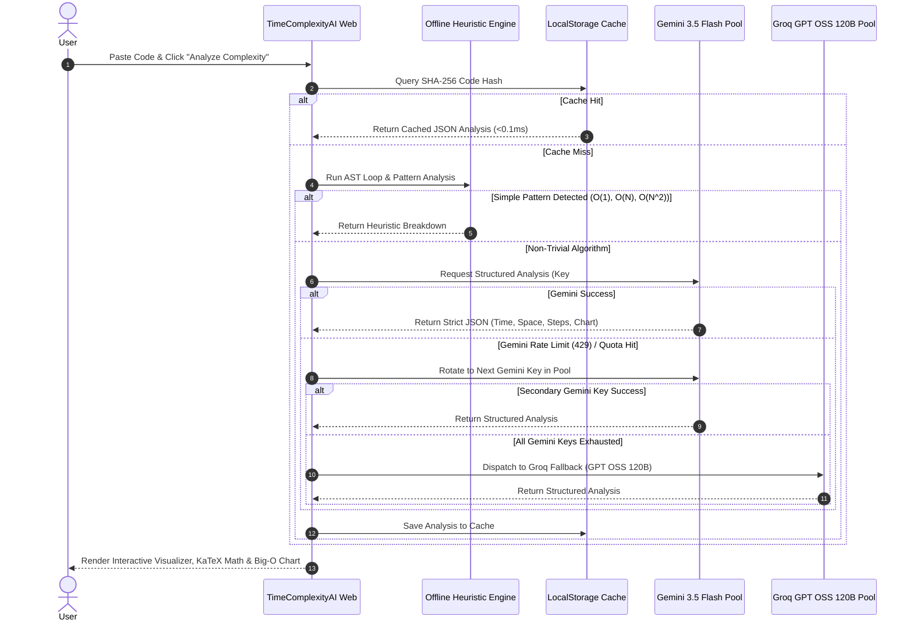

# 📖 TimeComplexityAI: The Premium AI Code Complexity Architect

[](https://timecomplexityai.vercel.app/)
[](https://react.dev/)
[](https://www.typescriptlang.org/)
[](https://tailwindcss.com/)
[](https://firebase.google.com/)
[](https://ai.google.dev/)
[](https://groq.com/)

**TimeComplexityAI** is a developer platform that transforms the abstract world of Big O notation into high-fidelity, interactive visual narratives. Engineered with an **Adaptive Multi-Provider AI Fallback Engine**, it ensures 99.9% uptime by automatically rotating through an elastic pool of Gemini and Groq (GPT OSS 120B) models with deterministic local heuristic acceleration.

---

## 🏗️ System Architecture

### 1. High-Level System Workflow

```mermaid
flowchart TD
    subgraph Client ["Client Browser (React 19 + Framer Motion)"]
        UI["Code Editor & Analysis Workspace"]
        AuthContext["Auth Context (Google Sign-In)"]
        LocalCache[("LocalStorage Cache")]
    end

    subgraph Orchestration ["Intelligent AI Orchestration Layer"]
        Heuristic["Local Offline AST Heuristic Analyzer"]
        Rotator["Dynamic Multi-Key Provider Rotator"]
    end

    subgraph Providers ["AI Inference Engine Pools"]
        GeminiPool["Google Gemini 3.5 Flash Pool (Auto-Rotating Keys)"]
        GroqPool["Groq High-Speed Inference (GPT OSS 120B)"]
    end

    subgraph Cloud ["Cloud Infrastructure & Persistence"]
        FirebaseAuth["Firebase Authentication (Google OAuth)"]
        FirestoreDB[("Cloud Firestore (User Profiles & History)")]
    end

    UI -->|1. Submit Code| LocalCache
    LocalCache -->|Cache Hit| UI
    LocalCache -->|Cache Miss| Heuristic
    Heuristic -->|Simple Pattern O(1), O(N)| UI
    Heuristic -->|Complex Analysis Required| Rotator

    Rotator -->|Primary Dispatch| GeminiPool
    GeminiPool -->|Quota Exceeded / Rate Limit| GroqPool
    GeminiPool -->|Success| UI
    GroqPool -->|Success| UI

    AuthContext <-->|OAuth 2.0| FirebaseAuth
    UI <-->|Sync Saved Analyses| FirestoreDB
```

### 2. Multi-Stage AI Fallback & Resilience Pipeline



---

## ✨ Features

- **🚀 Hybrid Multi-AI Fallback Orchestration**: Zero downtime AI analysis cycling through an auto-rotating pool of Gemini API keys with instant fallback to Groq GPT OSS 120B.
- **⚡ Deterministic Instant Caching**: Automatic code hashing with `localStorage` persistence gives 0ms latency for previously analyzed code snippets.
- **🏠 Client-Side Heuristic Analyzer**: Lightweight static analysis engine that identifies common algorithmic patterns without consuming API quota.
- **📊 Interactive Big-O Visualizer**: Real-time interactive complexity curve plotting using Recharts and KaTeX mathematical notation.
- **🔐 Google Cloud Authentication & Firestore Sync**: Seamless Google Sign-In with automatic cross-device syncing of analysis history.
- **🎨 Glassmorphic Neobrutalist UI**: Modern dark-mode aesthetic with Framer Motion micro-interactions and syntax-highlighted code editor.
- **🌐 SEO-Ready SSR & Static Prerender Pipeline**: Full SSG/prerender scripts and dynamic sitemap generation for top-tier search engine visibility.

---

## 📁 Repository Structure

```text
algostory/
├── public/                 # Static assets, sitemap.xml, robots.txt
├── scripts/                # SSR Prerender, Sitemap Generator, Diagnostics
│   ├── generate-sitemap.ts
│   ├── prepare-prerender.ts
│   └── prerender.js
├── src/
│   ├── components/         # Reusable UI components (Layout, Header, Navigation)
│   ├── contexts/           # React Contexts (AuthContext)
│   ├── data/               # Blog posts, tutorials, and algorithm metadata
│   ├── lib/                # Firebase, Firestore, and AI client configuration
│   ├── pages/              # Route views (Home, Time/Space Calculator, MathLab, Blog)
│   ├── utils/              # SSR-safe environment helpers, math helpers
│   ├── App.tsx             # Main Application Component
│   ├── AppRoutes.tsx       # Route definitions
│   ├── entry-client.tsx    # Client-side hydration entry
│   └── entry-server.tsx    # Server-side prerender entry
├── firestore.rules         # Security rules for Cloud Firestore
├── tailwind.config.js      # Styling configuration
├── vite.config.ts          # Vite build, SSR, and chunk optimization config
└── package.json            # Scripts & dependencies
```

---

## 🛠️ Setup & Installation

### Prerequisites
- **Node.js**: v18.0.0 or higher
- **npm** or **pnpm**

### 1. Clone & Install

```bash
git clone https://github.com/garg-sushant/timecomplexityai.git
cd timecomplexityai
npm install
```

### 2. Configure Environment Variables

Create a `.env` file in the root directory by copying the sample:

```bash
cp .env.example .env
```

Fill in your configuration:

```env
# ⚛️ Firebase Configuration
VITE_FIREBASE_API_KEY="AIzaSyXXXXXXXXXXXXXXXXXXXXXXXXXXXXXXX"
VITE_FIREBASE_AUTH_DOMAIN="your-project-id.firebaseapp.com"
VITE_FIREBASE_PROJECT_ID="your-project-id"
VITE_FIREBASE_STORAGE_BUCKET="your-project-id.firebasestorage.app"
VITE_FIREBASE_MESSAGING_SENDER_ID="123456789012"
VITE_FIREBASE_APP_ID="1:123456789012:web:abcdef123456"

# 🚀 AI Provider Pools (Comma-separated for automated key rotation)
VITE_GEMINI_API_KEY="gemini_key_1,gemini_key_2,gemini_key_3"
VITE_GROQ_API_KEY="groq_key_1,groq_key_2"

# 🌐 App Settings
VITE_SITE_URL="https://timecomplexityai.vercel.app"
APP_URL="https://timecomplexityai.vercel.app"
VITE_ENABLE_CACHE="true"
```

### 3. Run Development Server

```bash
npm run dev
```

The application will be accessible at `http://localhost:3000`.

---

## 🔐 Firebase & Firestore Configuration

1. **Authentication**:
   - Go to [Firebase Console](https://console.firebase.google.com/) → **Authentication** → **Sign-in method**.
   - Enable **Google** provider and configure your support email.
   - Go to **Settings** → **Authorized domains** and ensure `localhost`, `127.0.0.1`, and your production domain are added.
2. **Cloud Firestore**:
   - Navigate to **Firestore Database** → Click **Create Database** (Database ID: `(default)`).
   - Deploy the provided [`firestore.rules`](file:///d:/complexity/algostory/firestore.rules) to ensure users can only access their own analysis history.

---

## 📦 Available Scripts

| Command | Description |
| :--- | :--- |
| `npm run dev` | Starts the Vite development server on port 3000 with HMR. |
| `npm run build` | Builds client assets and runs SSR prerender pipeline. |
| `npm run preview` | Previews the production build locally. |
| `npm run lint` | Runs TypeScript static type checking (`tsc --noEmit`). |
| `npm run prebuild` | Generates routes and dynamic `sitemap.xml`. |

---

## 👨‍💻 Engineering Team

**Sushant Garg**  
[](https://github.com/garg-sushant)
[](https://www.linkedin.com/in/sushant-garg-4b0a37284/)

**Akshat Aggarwal**  
[](https://github.com/akshat-chd)
[](https://www.linkedin.com/in/akshat-aggarwal-10bbba301/)

---

## 📄 License
Licensed under the [MIT License](LICENSE).
